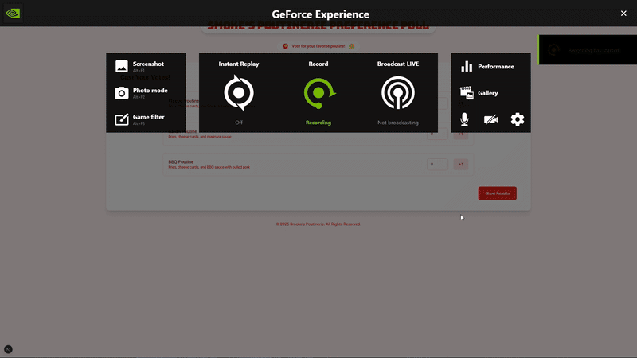

# Poutine Voting App

Just another passion project for my love of poutine.

Commands to run next app:

(1). Install external dependencies:

`npm install recharts`

(2). Run app:

`npm run dev`

or

`npm run build`
`npm start`

# A Quick Peek:

